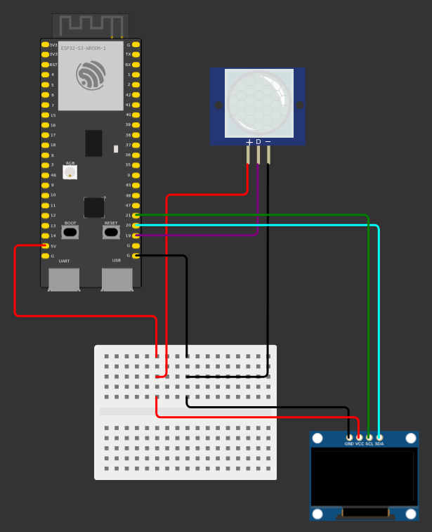

# System monitorowania przestrzeni domowej z wykorzystaniem ESP32 i aplikajci mobilnej

## :fire: Projekt w ramach pracy licencjackiej, system monitorowania pozwalający odebrać powiadomienie o wykryciu ruchu wraz ze zdjęciem i możliwością zapisania go w pamięci urządzenia mobilnego :fire:
Głównym zadaniem systemu jest danie użytkownikowi możliwości monitorowania,
przestrzeni domowej bez fizycznej obecności lub obserwowania danego miejsca, 
dzięki zbudowanemu urządzeniu oraz aplikacji mobilnej, która pozwala wyświetlić odebrane informacje.
System zbudowany jest według architektury klient-serwer i opiera się na 
urządzeniu zbudowanym z ESP32-S3 z modułem kamery, czujnikiem ruchu i wyświetlaczem
oraz z aplikacji mobilnej dla użytkownika. Aplikację mobilną można uruchomić
na telefonach z systemem Android, fizyczną część systemu należy złożyć z wykazanych części.

## :hammer_and_wrench: Stos technologiczny :hammer_and_wrench:
* Backend: C++ 
* Aplikacja mobilna: Kotlin, Jetpack Compose

## :gear: Wymagania i budowa systemu :gear:
### Przed uruchomieniem systemu należy zbudować urządzenie na bazie ESP32, które złożone jest z:
* ESP32-S3-CAM (OV3660)
* HC-SR501 (czujnik ruchu)
* SSD1336 OLED 0,96' (wyświetlacz)
* płytka stykowa lub złączki elektryczne
* przewody stykowe w liczbie 9 (6 M-F, 3 F-F)

### Instalacja oprogramowania na ESP32
1. Otwórz katalog ```esp/main``` w ArduinoIDE
2. W zakładce ```Tools``` ustaw:
   * ```Flash Size: "16MB (128Mb)"```
   * ```Partition Scheme: 16MB "(3MB APP/9.9MB FATFS)"```
3. Podłącz ESP32-S3 do komputera
4. Skompiluj i wgraj kod na płytkę

### Schemat obwodu:


### Aplikacja mobilna:
Otwórz katalog z aplikacją moiblną w Android Studio, zainstaluj na urządzeniu mobilnym
z systemem Android lub na emulatorze.

## :rocket: Użycie :rocket:
Zbudowane we wcześniejszych krokach urządzenie należy zasilić przez podłączenie go do 
gniazdka elektrycznego. Następnie użytkownik może połączyć się przez Wi-Fi lub Bluetooth i
rozpocząć korzystanie z systemu.

System zawiera kilka funkcjonalności:

* Wysyłanie powiadomienia o wykryciu ruchu i zdjęcia z kamery
* Zapisywanie odebranych obrazów w pamięci urządzenia
* Ręczne zażądanie obrazu z kamery
* Wyświetlenie stanu systemu, połączenia aplikacji mobilnej i ESP32

## Autor :pencil:
Adam Nowak
